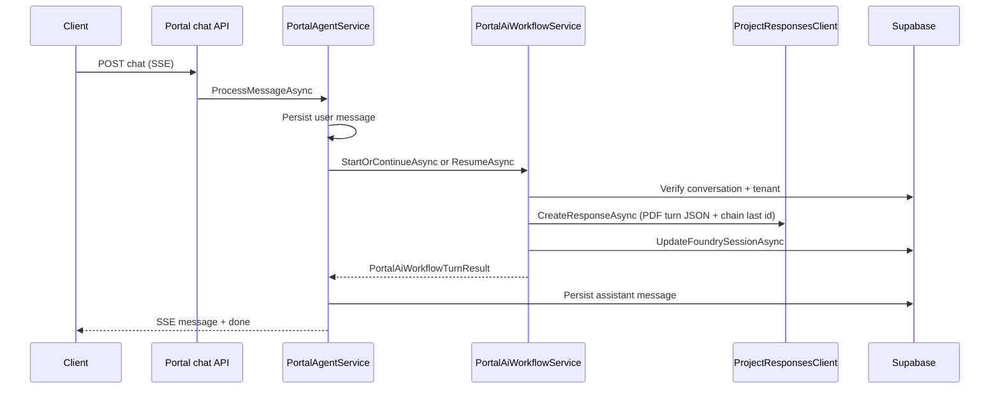

# ATMET AI Assistant (Foundry) — technical reference

Quick reference for engineers working on the Foundry workflow path, internal reads, and portal chat integration.

---

## Configuration (`AzureAI` section)

| Key                                     | Purpose                                                                                        |
| --------------------------------------- | ---------------------------------------------------------------------------------------------- |
| `ProjectEndpoint`                       | Foundry project URL (also `AzureAI__ProjectEndpoint` in environment)                           |
| `ManagedIdentityClientId`               | User-assigned MI client id; if empty, `DefaultAzureCredential`                                 |
| `WorkflowAgentName`                     | `AgentReference` name in Foundry (set per environment); **required** for portal SSE chat      |
| `WorkflowAgentVersion`                  | `AgentReference` version (e.g. `7`)                                                            |
| `PortalAgentId` / `PortalAgentName` / … | Persistent Agents assistant settings for **generic agent admin APIs** (`IAgentService`), not portal SSE chat |

Files: `src/ATMET.AI.Api/appsettings.json`, `appsettings.{Environment}.json`. The `WorkflowSpike` harness uses the same `AzureAI` keys (or `AzureAI__*` environment overrides).

---

## Projects and packages

| Area                    | Location / package                                                                                       |
| ----------------------- | -------------------------------------------------------------------------------------------------------- |
| Workflow spike          | `src/tools/ATMET.AI.WorkflowSpike` — `Azure.AI.Projects`, `Azure.AI.Extensions.OpenAI`, `Azure.Identity` |
| API host                | `src/ATMET.AI.Api`                                                                                       |
| Orchestration           | `src/ATMET.AI.Infrastructure/Services/PortalAiWorkflow/PortalAiWorkflowService.cs`                       |
| Internal reads          | `src/ATMET.AI.Infrastructure/Services/Foundry/FoundryAgentReadService.cs`                                |
| OpenAI preview suppress | `OPENAI001` on Infrastructure and WorkflowSpike projects                                                 |

`AzureAIClientFactory` (`Infrastructure/Clients/AzureAIClientFactory.cs`) builds `AIProjectClient` from `ProjectEndpoint` + credential.

---

## Core types

| Type                                                                                                                 | File                                                              |
| -------------------------------------------------------------------------------------------------------------------- | ----------------------------------------------------------------- |
| `IPortalAiWorkflowService`                                                                                       | `ATMET.AI.Core/Services/IPortalAiWorkflowService.cs`          |
| `PortalAiWorkflowStartRequest`, `PortalAiWorkflowResumeRequest`, `PortalAiThreadState`, `PortalAiWorkflowTurnResult` | `ATMET.AI.Core/Models/PortalAiWorkflow/PortalAiWorkflowModels.cs` |
| `FoundryConversationSessionPatch`                                                                                    | `ATMET.AI.Core/Models/Portal/FoundryConversationSessionPatch.cs`  |
| `CaseDetailForAgent`, `ServiceDetailForAgent`, …                                                                     | `ATMET.AI.Core/Models/Foundry/FoundryAgentReadModels.cs`          |
| `IFoundryAgentReadService`                                                                                           | `ATMET.AI.Core/Services/IFoundryAgentReadService.cs`              |

`PortalAiWorkflowTurnResult` includes `AssistantOutput` (text from `ResponseResult.GetOutputText()`) for portal persistence.

---

## HTTP routes

### Portal (citizen / BFF)

#### Frontend ↔ API contract (`POST …/chat`)

| Direction | Item | Details |
|-----------|------|---------|
| Request | URL | `POST /api/v1/portal/conversations/{conversationId}/chat` |
| Request | Headers | `X-Api-Key`, `X-Portal-User-Id`, `X-Portal-Entity-Id`, optional `X-Portal-Language` (`en` / `ar`) |
| Request | Body | JSON **`PortalChatMessage`**: `id`, `role` (`user`), **`type`** (discriminant), optional `content`, optional `data` (`JsonElement`), `timestamp`, optional `attachments` |
| Response | Stream | **`text/event-stream`**; each line `data: {…}` where JSON matches **`PortalChatEvent`** (`eventType`, optional `message`, …); stream ends with `data: [DONE]` |
| User → API | Resume after pause | **`type`:** **`workflow_resume`** (constant `PortalMessageTypes.WorkflowResume`), **`data`:** **`PortalAiWorkflowResumeData`** — `previousResponseId` (required), `resumePayload` (optional). Optional user **`content`** becomes follow-up text merged server-side. |
| API config | Portal chat | **`PortalAgentService`** always delegates to **`IPortalAiWorkflowService`** (Foundry Project Responses). **`WorkflowAgentName`** / **`WorkflowAgentVersion`** must match the deployed workflow agent. |

- `POST /api/v1/portal/conversations/{conversationId}/chat` — SSE; client sends `type: workflow_resume` with `data.previousResponseId` to resume after HITL pause; MUBASHIR shows **`WorkflowHitlBanner`** + `MessageRenderer` placeholder when resume has no `content`.

### Internal Foundry tools (not for browser)

Base: `/api/v1/internal/foundry`

| Method | Path                                    | Headers                           |
| ------ | --------------------------------------- | --------------------------------- |
| GET    | `/cases/{caseId}`                       | `X-Api-Key`, `X-Portal-Entity-Id` |
| GET    | `/cases/by-reference/{referenceNumber}` | same                              |
| GET    | `/services/{serviceId}`                 | same                              |

Authorization: same `ApiReader` policy as other `/api/v1` routes.

Implementation: `src/ATMET.AI.Api/Endpoints/InternalFoundryAgentEndpoints.cs`.

---

## Database (Supabase)

Table `public.conversations` — Foundry session columns (see migration `atmet-ai-web/supabase/migrations/*foundry*` or equivalent):

- `foundry_project_conversation_id`
- `foundry_run_id`
- `last_response_id`
- `pause_ui_action`, `pause_waiting_for`
- `foundry_current_step`
- `conversation_language`

Updates: `IPortalConversationService.UpdateFoundrySessionAsync` — non-null patch properties are sent as usual. When the body includes JSON nulls (e.g. `ClearPauseFields`), serialization uses `SupabaseRestClient.JsonOptionsIncludeNulls` so PostgREST clears `pause_*` columns.

---

## Portal chat: `workflow_resume`

User message **`type`:** `workflow_resume` (see `PortalMessageTypes.WorkflowResume`, `PortalAiWorkflowResumeData`).

- **`data.previousResponseId`** (required): Foundry response id to resume from.
- **`data.resumePayload`** (optional): structured client payload merged into the resume JSON sent to the model (`client` key), plus optional **`content`** as `followUpText`.

On the current API, **`workflow_resume`** is always handled by the workflow service (not a legacy Persistent Agents path).

---

## Runtime flow (portal chat)

Each turn sends a **single JSON string** to Foundry with **`user_message`**, **`language`**, **`thread_state`** (`service_id`, `case_id`, `current_step`, `last_agent`), **`attachments`**, and on resume **`resume_payload`** (Tax Assistant PDF §2 / §6). Case/service details are **not** inlined as prose; the workflow agent should use tools using ids from `thread_state`.

Internal HTTP routes are **optional** for the same reads when tools are configured on the Foundry side; the workflow service does not call HTTP loopback.

---

## Chaining rule (`previous_response_id`)

In `PortalAiWorkflowService`:

- If `conversations.foundry_project_conversation_id` is **missing**, a new Foundry project conversation is created; **`last_response_id` is not used** for chaining on that turn (avoids stale id).
- If it **exists**, `CreateResponseAsync` uses `previousResponseId` from `explicitPreviousResponseId` (`ResumeAsync`) or `conversations.last_response_id` (`StartOrContinueAsync`).

---

## Dependency injection

Registered in `ATMET.AI.Infrastructure/Extensions/ServiceCollectionExtensions.cs` (`AddSupabaseServices`):

- `IFoundryAgentReadService` → `FoundryAgentReadService`
- `IPortalAiWorkflowService` → `PortalAiWorkflowService`

`PortalAgentService` constructor receives Supabase + portal domain services, `IPortalAiWorkflowService`, and `ILogger<PortalAgentService>` (no Azure AI options type for portal chat orchestration).

---

## Observability (structured logs + distributed traces)

`PortalAiWorkflowTelemetry.Source` is an `ActivitySource` named **`ATMET.AI.PortalWorkflow`**. `PortalAiWorkflowService` starts an activity **`PortalWorkflow.ExecuteTurn`** per turn with tags `atmet.conversation_id`, `atmet.entity_id`, `atmet.turn_kind`, `atmet.foundry_project_conversation_id`, `atmet.foundry_response_id`, `atmet.workflow_status`, `atmet.workflow_duration_ms`.

When `ApplicationInsights:ConnectionString` is set and the host is not **`Testing`**, **`ObservabilityExtensions`** reads the **`ApplicationInsights`** section via **`ApplicationInsightsMonitorOptions`**: **`EnableAdaptiveSampling`** maps to a trace sampler (ratio-based when `true`, always-on when `false`); **`EnableDependencyTracking`** selects full **`UseAzureMonitor()`** (includes outgoing HTTP) vs a trace-only pipeline (ASP.NET + **`ATMET.AI.PortalWorkflow`** source + Azure trace exporter, no HTTP client instrumentation); **`EnablePerformanceCounterCollectionModule`** only gates **metrics** registration in that trace-only path (classic Windows perf counters have no direct OTel twin). A **`TelemetryClient`** singleton remains for **`TrackException`** in middleware. See [DASHBOARDS-AND-KQL.md](./DASHBOARDS-AND-KQL.md).

Workflow and portal SSE paths emit **named template properties** (Serilog → Application Insights when configured):

| Property | Where | Meaning |
|----------|--------|---------|
| `AtmetConversationId` | `PortalAiWorkflowService` scope | Portal conversation UUID |
| `AtmetEntityId` | workflow scope | Tenant |
| `AtmetWorkflowTurnKind` | workflow scope + portal | `start_continue` or `resume` |
| `AtmetFoundryProjectConversationId` | turn completion line | Foundry project conversation id |
| `AtmetFoundryResponseId` | turn completion line | Response id after `CreateResponseAsync` |
| `AtmetWorkflowStatus` | turn completion | Normalized status (`completed`, `paused_for_hitl`, …) |
| `AtmetWorkflowDurationMs` | turn completion + portal | Wall time for the turn / SSE workflow segment |
| `AtmetChainedPreviousResponse` | turn completion | Whether `previous_response_id` was sent |
| `AtmetNewFoundryConversation` | turn completion | Whether a new Foundry project conversation was created this turn |
| `AtmetPortalConversationId` | `PortalAgentService` scope | Same as conversation id (portal naming) |
| `AtmetPortalMessageType` | portal scope | Incoming `PortalChatMessage.Type` |

Do not log raw user message bodies on the workflow path.

---

## Integration tests (`src/ATMET.AI.Api.Tests`)

- **`WebApplicationFactory<Program>`** (`AtmetApiFactory`) merges **`appsettings.Integration.json`** into host configuration so **`ApiKeys:Keys`** matches the key clients use from **`IntegrationTestConfig.ApiKey`** (no hardcoded secret in test code).
- **`ASPNETCORE_ENVIRONMENT=Testing`**; **`IFoundryAgentReadService`** → **`FakeFoundryAgentReadService`** (no Supabase for those routes).
- **`InternalFoundryIntegrationTests`** assert **400** (missing `X-Portal-Entity-Id`), **401** (missing `X-Api-Key`), **404** (wrong entity), **200** (happy path).

---

## Response mapping (`PortalAiWorkflowResponseMapper`)

- Reads `ResponseResult.Status` via reflection (`completed`, `failed`, `incomplete`, …).
- Parses **Tax Assistant PDF §7** pause objects (e.g. `ui_action`, `message_to_user`, `required_fields`, `run_id`, `status: paused`) plus **legacy** `{ pause, uiAction, waitingFor }` via **`WorkflowPauseEnvelopeParser`**; normalized JSON is stored in **`conversations.pause_envelope`** with denormalized **`pause_ui_action`**, **`pause_waiting_for`**, **`foundry_run_id`**. Short string fields are capped at **`WorkflowPauseEnvelopeParser.MaxPauseFieldLength`** (2048). There is **no** embedded JSON Schema (JsonSchema.Net removed from Core).
- Merges pause hints from **tool output**: reflects **`ResponseResult.OutputItems`** and scans tool-like items for string properties named **`Output`**, **`Content`**, **`Result`**, **`Text`**, or **`Arguments`** containing `{...}` JSON (SDK shape varies by version).
- OpenAI **`incomplete`** (and similar) is normalized to **`paused_for_hitl`** for portal semantics until tool-waiting is modeled explicitly.

---

## Related documentation

- [DASHBOARDS-AND-KQL.md](./DASHBOARDS-AND-KQL.md) — Application Insights queries and workbook tiles  
- [STAGING-CHECKLIST.md](./STAGING-CHECKLIST.md) — staging validation for workflow agent config + pause/resume + optional HTTP tools  
- [OPERATIONS.md](./OPERATIONS.md) — workflow-only portal chat, App Service cleanup, product responsibilities
- [ARCHITECTURE.md](../ARCHITECTURE.md) — solution layering
- [API-REFERENCE.md](../API-REFERENCE.md) — general API surface
- [FoundryWorkflowSample.txt](../FoundryWorkflowSample.txt) — SDK snippet
